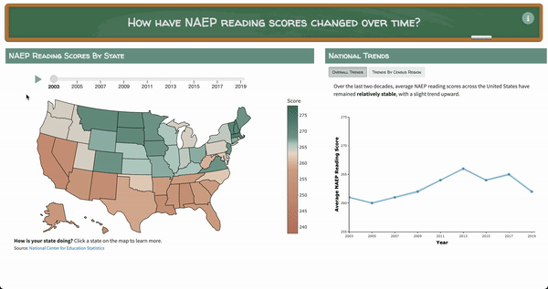

# NISS SAID 2022

Explore how NAEP reading scores have changed over time by visiting https://tiffanymtang.shinyapps.io/NISS-reading-scores/.



### Description 

This graphic compares trends over time in average National Assessment of Educational Profress (NAEP) reading scores for 8th grade public school students at the national, regional, and state level. This information is collected bianually from 2003 - 2019 from a represenative random sample of public schools around the United States. 

### Accessability Statement

The graphic employs color-blind and monochromatic vision friendly color scales based on those used by the New York Times. We provide text headers, text descriptions of time-series trends, and a zoom option on the map. We note the following limitations. There is no alt-text in our graphic and there is no option to select the initial state in the state-level time series plot except to click on the map. This might be difficult for users on small screens, such as cellphones or e-readers. The graphic may also be difficult to navigate for users who favor keyboard controls over the use of mouse or touch screen controls. The graphic is currently only available in English. Language options, text size or font adjustment options, and an option to have text read out to the user could be added to improve accessibility.

### Launching the Application Locally

To launch the interactive application locally, run the following command in R:

```R
shiny::runGitHub(repo = "tiffanymtang/NISS-SAID-2022")
```
